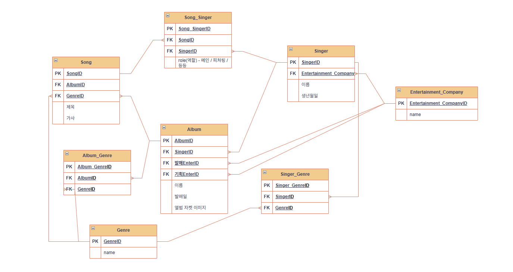

# 4주차 AI 개발자 과정 학습 정리 (ERD 1차 수정안)

## 오늘 학습 요약
- 단순 1:N 구조에서 벗어나 현실적인 비즈니스 로직(피처링, 다중 장르 등) 반영
- 매핑 테이블(`Song_Singer`)을 통한 다대다 관계 해결 및 추가 속성(`role`) 정의
- 엔터테인먼트사(기획/배포)와 장르 테이블의 분리를 통한 데이터 정규화 실습

---

## 배운 개념 정리
### 1. 다대다(N:M) 관계와 매핑 테이블
- **문제**: 한 노래를 여러 가수가 부를 수 있고, 가수는 여러 노래를 부름.
- **해결**: `Song_Singer`라는 연결 테이블을 만들어 각 관계마다 '메인', '피처링' 등의 역할을 저장함.

### 2. 다중 외래키(FK) 활용
- 한 앨범이 **기획사**와 **배포사**를 각각 가질 수 있도록 `Entertainment_Company` 테이블을 참조하는 FK를 두 개 설정함.

### 3. 역정규화의 고려
- 노래에는 하나의 장르를 두되, 앨범은 여러 장르를 가질 수 있도록 설계함.
- 조회 성능과 데이터 관리의 편의성을 위해 노래의 장르를 앨범에서 중복 관리할지(역정규화) 고민함.

---

## 오늘 작성한 코드리뷰 (ERD 2차 설계 분석)
- **Song_Singer**: `SongID`와 `SingerID`를 묶어주는 핵심 테이블. `role` 컬럼을 통해 가수의 참여 성격을 명시함.
- **Album**: `발매EnterID`와 `기획EnterID`를 분리하여 더 상세한 비즈니스 데이터 수집 가능.
- **Genre & Album_Genre**: 앨범이 다양한 음악적 색깔(다중 장르)을 가질 수 있도록 다대다 구조로 설계함.

---

## 이미지 파일 확인

*(참고: 상위 폴더의 images 폴더에 저장된 고도화된 ERD 이미지)*

---

## 실수/에러와 해결 과정
- **문제**: 처음에 가수가 한 명의 소속사에만 속한다고 가정함.
- **사고의 전환**: 실제로는 그룹 활동과 솔로 활동의 소속사가 다르거나 이적하는 경우가 있음.
- **해결**: 일단 기본 설계는 1:N으로 하되, 향후 이력 관리를 위해 소속사 연결도 매핑 테이블로 확장 가능한 구조임을 인지함.

---

## 실무 관점의 참견 적용해보기
- **데이터 무결성**: `role` 컬럼에 '메인', '피처링' 외에 잘못된 값이 들어오지 않도록 DB 수준에서 `CHECK` 제약조건이나 `ENUM` 타입을 사용하는 것이 좋음.
- **보안/효율**: 앨범 자켓 이미지 경로(`앨범 자켓 이미지`)를 DB에 저장할 때, 실제 이미지는 S3 같은 저장소에 올리고 DB에는 그 'URL 주소'만 담는 것이 실무 표준임.